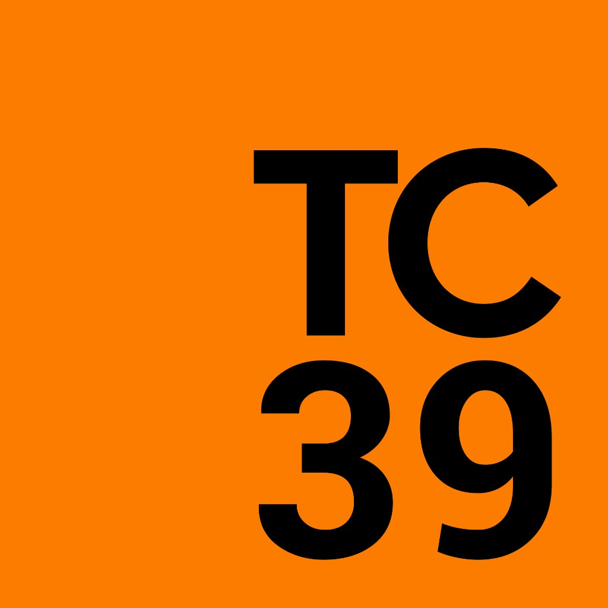

# Как фичи попадают в JavaScript

Как устроен ТС39 и за какими стадиями следить разработчикам?

---
transition: fade-out
class: tc39-slide
---

# Как комитет TC39 развивает JavaScript


<div class="tc39-wrap">
<div class="tc39-body">

- **Создает спецификацию ECMAScript**: Это международная группа экспертов, которая решает, как именно будет развиваться язык.
- **Объединяет главных IT-гигантов**: В комитет входят делегаты от Google, Apple, Mozilla, Microsoft и других корпораций.
- **Работает на основе консенсуса**: Если хотя бы один участник против новой фичи — она не пройдет.
- **Ведет разработку открыто**: Все обсуждения, предложения (proposals) и протоколы встреч публично доступны на GitHub.

</div>
<div class="tc39-logos">
  
  
</div>
</div>


---
transition: slide-up
class: champions-slide
---

# Кто такие Champions?

<div class="temporal-body">
<div>

- **Добровольно берут ответственность за фичу.** Это участники комитета TC39, которые сами вызываются развивать идею.
- **Ведут проект от идеи до релиза.** Сами пишут текст спецификации, защищают её на встречах и продвигают по всем стадиям.
- **Согласуют фичу со всеми сторонами.** Отвечают на техническую критику на GitHub, общаются с авторами браузеров.
- **Если нет лидера работа прекращается.** Без активного автора предложение перестают обсуждать, и проект уходит в архив.

</div>
<div class="temporal-photo">
  
</div>
</div>

---
class: stages-slide
notes: |
  Stage 2.7 — инсайд. Дизайн уже заморожен, пишут test262. Без тестов в тройку не пустят.
---

# Стадии TC39

<div class="temporal-body">
<div class="tc39-stages">

<div class="tc39-stage">
<strong>0: Strawman.</strong> Автор предлагает сырую идею и приносит её на обсуждение в комитет.
</div>

<div class="tc39-stage">
<strong>1: Proposal.</strong> Автор доказывает важность проблемы, у фичи появляется чемпион.
</div>

<div class="tc39-stage">
<strong>2: Draft.</strong> Авторы прописывают точный синтаксис и фиксируют архитектуру в спецификации.
</div>

<div class="tc39-stage tc39-stage-27">
<strong>2.7: Assessment.</strong> Авторы пишут тесты, чтобы проверить дизайн фичи и больше его не менять.
</div>

<div class="tc39-stage">
<strong>3: Candidate.</strong> Разработчики движков (V8, WebKit) пишут нативный код фичи в браузерах.
</div>

<div class="tc39-stage">
<strong>4: Finished.</strong> Комитет официально включает готовую фичу в ежегодный стандарт JavaScript.
</div>

</div>
<div class="temporal-photo">
  
</div>
</div>

---
class: decorators-slide
---

# Decorators

<div class="temporal-body">
<div>

- **Давно работают в экосистеме.** Разработчики годами используют декораторы `@Injectable()` или `@Get()` в Angular, NestJS.

- **Не поддерживаются средой выполнения.** Этот код компилируется инструментами сборки, но браузеры чистый синтаксис декораторов до сих пор не понимают.

- **Откатились на стадию 2.7 из-за проблем со скоростью.** Спецификацию пытаются утвердить с 2016 года. Проект доходил до Stage 3, но его вернули назад, так как первоначальный дизайн сильно тормозил браузерные движки.

- **Ломают внутреннюю оптимизацию движков.** Браузеру нужно заранее знать точную структуру класса, чтобы выполнять код быстро. Декоратор же меняет класс на лету — перетряхивает методы и лезет в приватные поля, превращая предсказуемый код в хаос.

</div>
<div class="temporal-photo">
  
</div>
</div>


---
class: two-fns-slide
---

# Старый vs Новый стандарт

<div class="two-fns-body">

TypeScript при сборке превращает `@logged` в обычный вызов. Какие аргументы туда подставить — решает он. В двух режимах это **разные аргументы**.

<div class="grid grid-cols-2 gap-4" style="--slidev-code-font-size: 14px; --slidev-code-line-height: 21px;">

```ts
// Nest / Angular сейчас
function logged(target, key, descriptor) {
  descriptor.value // здесь лежит исходный save
}
```

```ts
// будущий стандарт
function logged(fn, context) {
  fn // исходный save сразу здесь
}
```

</div>

Предположим, вы включили новый режим, а функции остались прежние: они берут `descriptor.value`, а `descriptor` — `undefined`.

Новый стандарт полностью меняет сигнатуру функций. **Ваши кастомные декораторы сломаются.**

</div>

<style>
.slidev-code {
  font-size: 14px !important;
  line-height: 21px !important;
}
</style>


---
class: temporal-slide
---

# Temporal

<div class="temporal-body">
<div>

* **Полностью заменяет старый объект Date.** Это глобальное обновление добавляет в язык целый набор новых классов для точной работы с датами, часовыми поясами и календарями.
* **Потребовал согласования на мировом уровне.** Авторы долго утверждали новый формат строк с часовыми поясами в международном комитете IETF, чтобы синтаксис подходил не только для JS.
* **Официально вошел в стандарт ECMAScript.** Спецификация защищена на Stage 4, а нативная поддержка `Temporal` уже работает в Firefox, Chrome и Node.js.

</div>
<div class="temporal-photo">
  
</div>
</div>


---
class: two-fns-slide temporal-slide
---

# Date vs Temporal

<div class="two-fns-body date-vs-grid">

<div class="date-vs-old">

```js
// Date

// Добавить 7 дней к дате (мутирует объект)
const date = new Date();
date.setDate(date.getDate() + 7);

// Сравнить две даты? Только через миллисекунды
const isAfter = date1.getTime() > date2.getTime();
```

</div>

<div class="date-vs-new">

```js
// Temporal

// Добавить 7 дней к дате
// (возвращает новый объект)
const nextWeek = Temporal.Now
  .plainDateISO()
  .add({ days: 7 });

// Понятное сравнение из коробки
const isAfter = Temporal.PlainDate.compare(
  date1,
  date2,
) > 0;
```

</div>

</div>

<style>
.slidev-code {
  font-size: 14px !important;
  line-height: 21px !important;
}
</style>


---
class: records-slide
---

# Records & Tuples

<div class="temporal-body">
<div>

* **Идея:** Неизменяемые записи (`#{ a: 1 }`) и кортежи (`#[1, 2]`), работающие как сложные примитивы со сравнением по значению, а не по ссылке.
* **Итог:** Фича полностью **отозвана со Stage 2 в апреле 2025 года** после 6 лет разработки.
* **Технологический тупик:**
  * **Производительность:** В отличие от низкоуровневых языков, в JS глубокая неизменяемость создавала колоссальную нагрузку на движки и сборщик мусора (GC).
  * **Семантика `===`:** Для глубокого сравнения оператор `===` пришлось бы превратить в тяжелую рекурсивную операцию O(N). Изменение логики главного оператора языка сочли критической ошибкой.
* **Что дальше:** Вместо примитивов обсуждается проект **Composites** — обычные объекты с поверхностной неизменяемостью и сравнением через метод `.equals()`.

</div>
<div class="temporal-photo">
  
</div>
</div>

---
class: links-slide
---

# Ссылки

<div class="grid grid-cols-[1fr_auto] gap-12 items-center">
<div>

Каталог TC39, протоколы заседаний, Decorators, Temporal, Records & Tuples.

</div>

<QrLink url="https://github.com/AnSBeliaev/features-in-java-script/blob/master/links.md" :size="220" label="github.com/…/links.md" />
</div>

